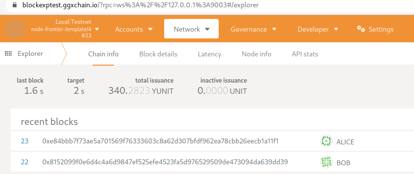
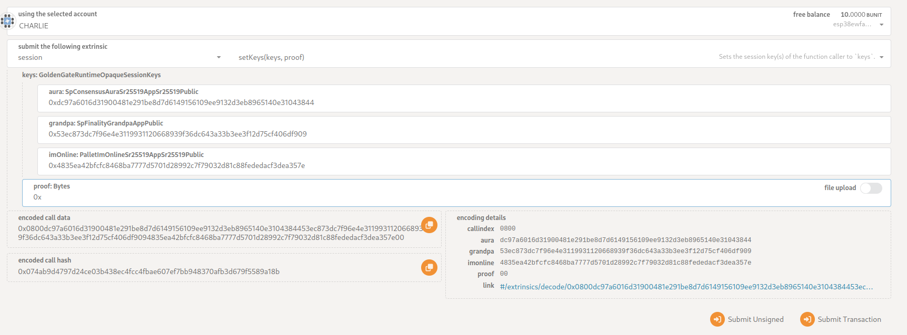
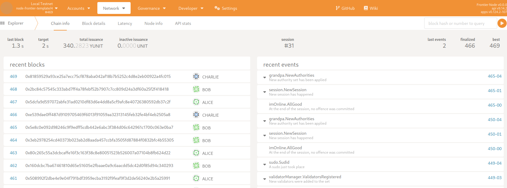
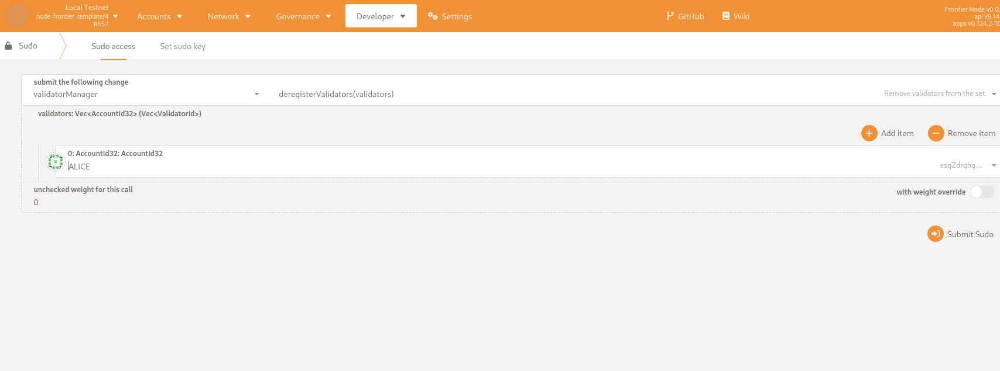
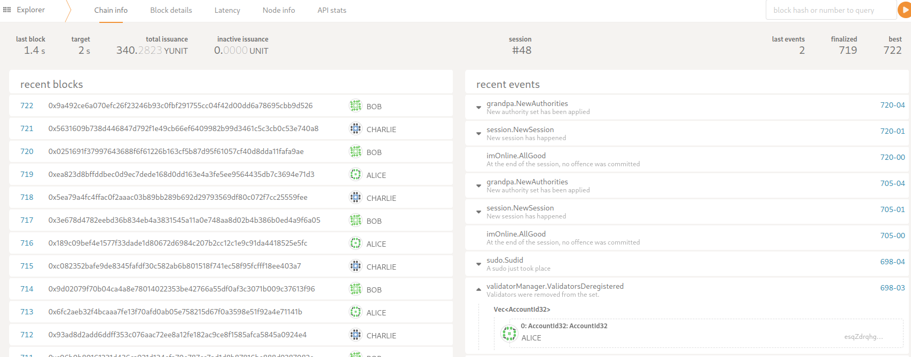

# Managing validator list

This document shows how to add and remove the validator.
Currently, the Golden Gate runs a Federated POA.
There are two ways to add or remove the validator:

* Using the sudo extrinsic to the validator_manager pallet.
* Modifying the genesis config

## SUDO mechanism

### Prerequisites

* We expect that you are familiar with how to set up and build our node
* This mechanism is executed in the runtime, and you are supposed to have a sudo privileged account.

Example:

```bash
# You can start a network using our nix flake file.
nix run .#multi-fast

# Alternatively, you can run nodes yourself in three different shells
cargo run --release -- --chain local --alice --tmp
cargo run --release -- --chain local --bob --tmp
cargo run --release -- --chain local --charlie --tmp --ws-port 9003
```

### Adding validator

Important:

* Please note, in our setup, Alice and Bob are validators initially, and we will add Charlie during the guide.
* Also, note that you must be connected to the validator you want to add (in our case, Charlie) to get a rotated key.
* For example, we set a session to 15 blocks (30 seconds). For you, it will take about 4 hours.

Steps:

* Validate that the network is working and that you can connect. Check that all validators behave properly. As you can see, Alice and Bob are producing blocks, and I have connected to the 9003 port, which is Charlie's.

  
* We have to allowlist Charlie initially. How to allowlist the validator user see in the [guide](../adding-user-to-allowlist/README.md)
* Go to Develop/RPC tab in the block explorer.
* Submit RPC to the author.rotateKeys()

  
* Copy the received key
  * In our example is: `0xdc97a6016d31900481e291be8d7d6149156109ee9132d3eb8965140e3104384453ec873dc7f96e4e3119931120668939f36dc643a33b3ee3f12d75cf406df9094835ea42bfcfc8468ba7777d5701d28992c7f79032d81c88fededacf3dea357e`
* We have received three keys. (can be more later one). Each key is 32 bytes (64 symbols omitting initial 0x). You have to split them into three separate parts as below
  * Aura: `0xdc97a6016d31900481e291be8d7d6149156109ee9132d3eb8965140e31043844`
  * Grandpa: `0x53ec873dc7f96e4e3119931120668939f36dc643a33b3ee3f12d75cf406df909`
  * I'm online: `0x4835ea42bfcfc8468ba7777d5701d28992c7f79032d81c88fededacf3dea357e`
* Go to the Developer/Extrinsics and submit the session.setKeys transaction

  
  * Fill the data with your keys
  * proof: `0x`

* Submit the transaction and sign it.
* Go to the Developer/Sudo tab and choose validatorManager.registerValidator transaction

  
* Submit sudo and sign the transaction.
* The validator is supposed to become active in two sessions. Verify that it is working.

  
* As you can see, Charlie becomes a validator.

### Removing validator

* Go to the Developer/Sudo tab and choose validatorManager.deregisterValidator transaction
* Choose the validator you want to remove

  
* Submit sudo and sign the transaction.
* The validator is supposed to become inactive in two sessions. Verify that it was removed.

  
* As you can see, Alice is not a validator anymore.

## Genesis config

You can specify initial validators in the GenesisConfig into the session pallet. The pallet accepts AccountId and SessionKeys for each validator.

```rust
session: SessionConfig {
    keys: initial_authorities
        .iter()
        .map(|x| -> (AccountId, AccountId, SessionKeys) {
            (
                x.id.clone(),
                x.id.clone(),
                SessionKeys {
                    aura: x.aura.clone(),
                    grandpa: x.grandpa.clone(),
                    im_online: x.im_online.clone(),
                },
            )
        })
        .collect::<Vec<_>>(),
},
```
